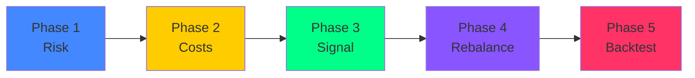

# 🔄 Crypto Funding Rate Arbitrage Engine

> Moteur d'arbitrage de taux de financement cross-exchange avec analyse statistique, backtest event-driven et exécution automatisée.

[](https://python.org)
[](https://fastapi.tiangolo.com)
[](https://nextjs.org)
[](https://redis.io)

---

## 📋 Table des matières

- [Vue d'ensemble](#-vue-densemble)
- [Architecture](#-architecture)
- [Structure du projet](#-structure-du-projet)
- [Installation](#-installation)
- [🆕 Tutoriel utilisateur externe](#-tutoriel-utilisateur-externe)
- [Guide d'utilisation (développeur)](#-guide-dutilisation-développeur)
- [Explication des fichiers](#-explication-détaillée-des-fichiers)
- [Stratégie d'arbitrage](#-stratégie-darbitrage)
- [Configuration](#%EF%B8%8F-configuration)

---

## 🎯 Vue d'ensemble

Ce projet identifie et exploite les différences de **taux de financement (funding rates)** entre 4 exchanges de dérivés crypto :

| Exchange | Type | Funding Interval |
|----------|------|-----------------|
| **Binance** | CEX | 8h (parfois 4h) |
| **Hyperliquid** | DEX (L1) | 1h |
| **Extended** | DEX (Starknet) | 1h |
| **Paradex** | DEX (Starknet) | 1h |

### Principe de l'arbitrage

```
Position Long (Exchange A)  ←→  Position Short (Exchange B)
         ↓                              ↓
   Reçoit le funding            Paie le funding
         ↓                              ↓
         └── Net Profit = Funding reçu - Funding payé - Frais ──┘
```

Le moteur est **delta-neutre** : les mouvements de prix s'annulent, le profit vient uniquement de la différence de funding.

---

## 🏗 Architecture

```
┌─────────────────────────────────────────────────────────┐
│                    Frontend (Next.js :3000)              │
│  Dashboard │ Live Monitor │ Strategy Lab │ Bot Control   │
└────────────────────────┬────────────────────────────────┘
                         │ REST API + WebSocket
┌────────────────────────┴────────────────────────────────┐
│                   Backend (FastAPI :8000)                │
│  ┌──────────┐  ┌──────────┐  ┌──────────┐              │
│  │ Strategy │  │   Bot    │  │  Data    │              │
│  │  Engine  │  │Supervisor│  │ Service  │              │
│  └──────────┘  └──────────┘  └──────────┘              │
└────────────────────────┬────────────────────────────────┘
                         │
         ┌───────────────┼───────────────┐
         ▼               ▼               ▼
   ┌──────────┐   ┌──────────┐   ┌──────────┐
   │  Redis   │   │ Parquet  │   │ Exchange │
   │  (Live)  │   │  (Hist)  │   │   APIs   │
   └──────────┘   └──────────┘   └──────────┘
```

---

## 📁 Structure du projet

```
PPE_Engineering_Upgrade/
│
├── 📂 data_collectors/              # Collecte de données
│   ├── 📂 historical/              # Fetchers historiques (6 mois)
│   ├── 📂 live/                    # Flux temps réel → Redis
│   └── 📂 pipeline/
│       └── cleaner.py              # Nettoyage et alignement multi-exchange
│
├── 📂 backend/                      # Serveur FastAPI
│   ├── main.py                     # Routes API + WebSockets
│   ├── schemas.py                  # Modèles de données (Pydantic)
│   ├── requirements.txt            # Dépendances Python
│   ├── 📂 services/
│   │   └── data_service.py         # Accès Parquet/Redis
│   ├── 📂 strategy/                # Moteur de stratégie
│   │   ├── risk_analysis.py        # Phase 1 : ADF, Cointégration
│   │   ├── cost_model.py           # Phase 2 : Frais, Slippage
│   │   ├── signal_generator.py     # Phase 3 : Z-Score
│   │   ├── rebalancer.py           # Phase 4 : Rebalancing
│   │   ├── backtester.py           # Phase 5 : Backtest par paire
│   │   ├── bot_backtester.py       # Backtest multi-paires (portfolio)
│   │   └── optimizer.py            # Grid search de paramètres
│   └── 📂 bot/                     # Bot d'exécution
│       ├── auth.py                 # Authentification JWT + gestion users
│       ├── executor.py             # Ordres via CCXT
│       ├── wallet_manager.py       # Transferts inter-exchanges
│       └── supervisor.py           # Boucle principale du bot
│
├── 📂 frontend/                     # Interface Next.js
│   └── 📂 src/app/
│       ├── page.tsx                # Dashboard principal
│       ├── 📂 live/                # Moniteur temps réel
│       ├── 📂 historical/          # Analyse historique
│       ├── 📂 strategy/            # Labo stratégie (backtest par paire)
│       ├── 📂 bot/                 # Contrôle du bot (login + clés API)
│       └── 📂 bot-portfolio/       # Backtest portfolio multi-paires
│
├── 📂 data/                         # Données (gitignored)
├── docker-compose.yml               # Déploiement Docker
├── Dockerfile.backend
├── Dockerfile.frontend
├── .env
└── README.md
```

---

## 🚀 Installation

### Prérequis

- **Python 3.10+**
- **Node.js 18+**
- **Redis** (en local ou Docker) : https://www.memurai.com/get-memurai

### 1. Cloner le repo

```bash
git clone https://github.com/ErwanSi/PPE_Engineering_Upgrade.git
cd PPE_Engineering_Upgrade
```

### 2. Backend Python

```bash
# Créer un environnement virtuel
python -m venv venv
source venv/bin/activate  # Linux/Mac
.\venv\Scripts\activate   # Windows

# Installer les dépendances
pip install -r backend/requirements.txt
```

### 3. Frontend Next.js

```bash
cd frontend
npm install
cd ..
```

### 4. Configuration

Copiez `.env.example` vers `.env` et remplissez si besoin :

```bash
cp .env.example .env
```

### 5. Lancer les services

```bash
# Terminal 1 — Backend
cd backend
python main.py

# Terminal 2 — Frontend
cd frontend
npm run dev
```

Accédez à **http://localhost:3000** 🎉

### Alternative — Docker (production)

```bash
docker compose up -d
```

Cela lance automatiquement Redis + Backend + Frontend.

---

## 👤 Tutoriel utilisateur externe

> Ce guide est destiné aux personnes qui ont reçu un accès au Bot de la part de l'admin.
> Vous n'avez pas besoin de connaissances en développement.

### Étape 1 — Accéder à l'application

Ouvrez l'URL fournie par l'admin dans votre navigateur (par ex. `http://adresse-du-serveur:3000`).

Vous arrivez sur le **Dashboard** — une page publique qui affiche les opportunités d'arbitrage en temps réel.

### Étape 2 — Explorer les pages publiques (sans login)

Ces pages sont accessibles **sans compte** :

| Page | Ce qu'elle montre |
|------|-------------------|
| **Dashboard** (`/`) | Vue d'ensemble : meilleures opportunités, statut du bot, APR moyens |
| **Live** (`/live`) | Matrice temps réel des taux de funding sur les 4 exchanges. Rafraîchie toutes les 15s |
| **Historical** (`/historical`) | Scanner d'opportunités historiques : classement des paires par APR sur 6 mois |
| **Strategy** (`/strategy`) | Backtest d'une paire spécifique : sélectionnez un token + 2 exchanges, ajustez les paramètres, lancez le backtest et visualisez Strategy vs Funding Hold |
| **Bot Portfolio** (`/bot-portfolio`) | Backtest multi-paires : simule le bot sur toutes les paires en même temps avec allocation dynamique |

💡 **Astuce** : Commencez par la page **Live** pour voir quels tokens ont les plus gros spreads en ce moment, puis allez dans **Strategy** pour backtester ces paires.

### Étape 3 — Se connecter au Bot

1. Cliquez sur **Bot** dans la barre latérale
2. Vous arrivez sur l'écran de login 🔐
3. Entrez les identifiants fournis par l'admin :
   - **Username** : votre nom d'utilisateur
   - **Password** : votre mot de passe
4. Cliquez **Sign In**

> ⚠️ Si vous n'avez pas de compte, contactez l'admin. Les comptes sont créés manuellement.

### Étape 4 — Configurer vos clés API

Avant de pouvoir trader en live, vous devez configurer vos clés d'exchange.

1. Une fois connecté, cliquez sur l'onglet **🔑 API Keys**
2. Pour chaque exchange que vous utilisez, renseignez :
   - **API Key** et **API Secret** (depuis votre compte exchange)
   - **Wallet Address** (si c'est un DEX comme Hyperliquid ou Extended)
3. Cliquez **💾 Save Credentials**

Vos clés sont stockées de manière chiffrée côté serveur et ne sont jamais affichées en clair (seuls les 4 premiers et 3 derniers caractères sont visibles).

> 💡 Vous pouvez commencer sans clés API : le bot fonctionne en mode simulation par défaut.

### Étape 5 — Choisir le mode du Bot

Dans l'onglet **🎛️ Control**, vous avez deux modes :

| Mode | Comment ça marche |
|------|-------------------|
| **📋 Manual** | Vous sélectionnez vous-même les paires à tracker. Ajoutez des paires avec "+ Add Pair", choisissez le token et les deux exchanges |
| **⚡ Auto** | Le bot sélectionne automatiquement les **3 paires avec le meilleur APR** depuis les données live. Les sélections sont verrouillées |

Pour basculer, cliquez simplement sur le bouton **Manual** ou **Auto** dans la barre de statut.

### Étape 6 — Démarrer le Bot

1. Configurez vos paires (ou passez en mode Auto)
2. Cliquez **▶ Start Bot**
3. Le bot génère immédiatement un **historique simulé de 60 jours** pour montrer la performance passée
4. Il ouvre des positions sur les paires sélectionnées
5. Le bot continue ensuite en **live** : il vérifie les signaux chaque minute et ajuste les positions

Vous verrez apparaître :
- La **mini-courbe d'equity** en haut (rendement cumulé sur 60 jours)
- Les **positions ouvertes** avec leur funding accumulé en temps réel
- Le **journal d'activité** avec les entrées, sorties, vérifications de marge...

### Étape 7 — Superviser le Bot

Le bot tourne en continu. Vous pouvez :

- **Onglet Control** : Voir les positions ouvertes, les signaux récents, la courbe de rendement
- **Onglet History** : Voir l'historique complet (trades fermés, PnL réalisé, win rate, PnL moyen par trade)
- **Journal d'activité** : Défiler les logs pour voir chaque action (entrées, sorties, alertes de marge)

Les métriques clés affichées :

| KPI | Signification |
|-----|---------------|
| **Realized PnL** | Profit net réalisé sur les trades fermés ($) |
| **Closed Trades** | Nombre de positions ouvertes puis fermées |
| **Win Rate** | Pourcentage de trades rentables |
| **Avg PnL/Trade** | Profit moyen par trade ($) |

### Étape 8 — Arrêter le Bot

1. Cliquez **■ Stop Bot**
2. Toutes les positions ouvertes sont fermées automatiquement
3. Les données sont effacées (PnL remis à zéro)
4. Au prochain redémarrage, une nouvelle simulation sera générée

> ⚠️ Arrêter le bot ne supprime pas vos clés API (onglet API Keys). Celles-ci restent sauvegardées.

### Étape 9 — Se déconnecter

Cliquez sur **Logout** en haut à droite. Votre session expire automatiquement après 24h.

---

### ❓ FAQ

**Q: Je n'ai pas de compte, comment en obtenir un ?**
> Contactez l'administrateur du projet. Les comptes sont créés manuellement dans le fichier de configuration du serveur.

**Q: Mes clés API sont-elles en sécurité ?**
> Oui. Elles sont stockées de manière chiffrée sur le serveur. L'admin du serveur peut les voir dans le fichier `bot_credentials.json`, mais elles ne sont jamais transmises en clair au navigateur (seule une version masquée est affichée).

**Q: Le bot trade-t-il avec du vrai argent ?**
> Par défaut, non. Le bot démarre en mode **paper** (simulation). Pour passer en mode live avec du vrai capital, l'admin doit changer la variable `BOT_MODE=live` dans la configuration du serveur et vous devez avoir renseigné vos clés API.

**Q: Pourquoi le PnL est à zéro quand j'ouvre la page Bot ?**
> C'est normal. Les données de performance ne sont générées que quand vous appuyez sur **Start**. Cela inclut une simulation rétrospective de 60 jours. Quand le bot est arrêté, tout est remis à zéro.

**Q: Qu'est-ce que le mode Auto fait exactement ?**
> Il analyse les taux de funding en temps réel et sélectionne les 3 paires les plus rentables (meilleur APR). Les paires sont mises à jour quand vous activez le mode Auto.

**Q: Comment lire la courbe d'equity ?**
> L'axe X = le temps (60 jours), l'axe Y = le PnL cumulé en $. Une courbe montante = le bot est rentable. Les drawdowns (baisses temporaires) sont normaux et attendus.

---

## 📖 Guide d'utilisation (développeur)

### Étape 1 — Collecter les données historiques

```bash
# Exécuter chaque fetcher (un par un ou en parallèle)
python data_collectors/historical/binance_funding.py
python data_collectors/historical/binance_prices.py
python data_collectors/historical/hyperliquid_funding.py
python data_collectors/historical/hyperliquid_prices.py
python data_collectors/historical/extended_funding.py
python data_collectors/historical/extended_prices.py
python data_collectors/historical/paradex_funding.py
python data_collectors/historical/paradex_prices.py
```

### Étape 2 — Nettoyer et aligner les données

```bash
python data_collectors/pipeline/cleaner.py
```

Cela génère les fichiers dans `data/processed/` :
- `MASTER_FUNDING_1H_*.parquet` — Funding rates alignés

### Étape 3 — Lancer les flux live

```bash
python data_collectors/live/binance_live.py
python data_collectors/live/hyperliquid_live.py
python data_collectors/live/extended_live.py
python data_collectors/live/paradex_live.py
```

### Étape 4 — Utiliser l'interface web

| Page | URL | Fonctionnalité |
|------|-----|---------------|
| Dashboard | `/` | Vue d'ensemble, top opportunités |
| Live Monitor | `/live` | Matrice live temps réel |
| Historical | `/historical` | Scanner d'opportunités + qualité données |
| Strategy Lab | `/strategy` | Analyse de risque + Backtest (Strategy vs Funding Hold) |
| Bot Control | `/bot` | Login, Start/Stop bot, positions, logs, clés API |
| Bot Portfolio | `/bot-portfolio` | Backtest multi-paires avec allocation dynamique |

### Gestion des utilisateurs (Admin)

Pour ajouter un nouvel utilisateur au bot, éditez le fichier `backend/bot/auth.py` :

```python
# Ligne ~19 — Ajouter une entrée ici
USERS = {
    "admin": "FundingArb2026!",
    "erwan": "PPE_Upgrade!",
    "nouveau_user": "son_mot_de_passe",  # ← ajouter ici
}
```

Redémarrez le backend pour appliquer les changements.

---

## 🔬 Explication détaillée des fichiers

### 📂 `data_collectors/historical/` — Collecte historique

Chaque fichier suit le même pattern :

1. **Fenêtre dynamique** : `now - 6 mois → now` (pas de dates hardcodées)
2. **Rate limiting** : Token Bucket ou Semaphore selon l'exchange
3. **Pagination** : Boucle jusqu'à épuisement des données
4. **Sauvegarde** : Parquet avec colonnes standardisées `(datetime, timestamp_ms, market, value)`

| Fichier | API | Rate Limit | Spécificité |
|---------|-----|-----------|-------------|
| `binance_funding.py` | `/fapi/v1/fundingRate` | 2400 weight/min | Pagination page par page (1000 records/page) |
| `binance_prices.py` | `/fapi/v1/klines` | 4 req/s | Chunks de 1500 bougies 5min |
| `hyperliquid_funding.py` | POST `/info` type:fundingHistory | 0.4 req/s | Token Bucket strict, API très restrictive |
| `hyperliquid_prices.py` | POST `/info` type:candleSnapshot | 0.33 req/s | Chunks de 24h obligatoires (API tronque sinon) |
| `extended_funding.py` | `/api/v1/info/{market}/funding` | 10 req/s | Concurrence via Semaphore |
| `extended_prices.py` | `/api/v1/info/candles/{market}/mark-prices` | 10 req/s | Pagination arrière (endTime → startTime) |
| `paradex_funding.py` | `/v1/funding/data` | 20 req/s | Pagination par cursor |
| `paradex_prices.py` | `/v1/markets/klines` | 20 req/s | Chunks de 200h |

---

### 📂 `data_collectors/live/` — Flux temps réel

Chaque script interroge son exchange périodiquement et publie dans Redis.

| Fichier | Méthode | Fréquence | Clé Redis |
|---------|---------|-----------|-----------|
| `binance_live.py` | REST polling | 30s | `{TOKEN}` → `{binance: rate}` |
| `hyperliquid_live.py` | REST polling | 60s | `{TOKEN}` → `{hyperliquid: rate}` |
| `extended_live.py` | REST polling | 30s | `{TOKEN}` → `{extended: rate}` |
| `paradex_live.py` | WebSocket | Temps réel | `{TOKEN}` → `{paradex: rate}` |

---

### 📂 `backend/strategy/` — Moteur de stratégie

| Module | Phase | Objectif |
|--------|-------|----------|
| `risk_analysis.py` | Phase 1 | Tests ADF + Engle-Granger (spread stationnaire ?) |
| `cost_model.py` | Phase 2 | Fees Maker/Taker + Slippage + Gas (Starknet) |
| `signal_generator.py` | Phase 3 | Signaux Z-Score rolling : `Z > 2 → ENTER`, `|Z| < 0.5 → EXIT` |
| `rebalancer.py` | Phase 4 | Vérification neutralité delta + marge |
| `backtester.py` | Phase 5 | Backtest par paire avec gate 1.2x coûts, SMA 6h exit, stop-loss -0.5% |
| `bot_backtester.py` | — | Backtest multi-paires (allocation $10k × 3 slots, lissage si PnL < 0) |
| `optimizer.py` | — | Grid search Z-Score × Lookback pour trouver les meilleurs paramètres |

### 📂 `backend/bot/` — Bot d'exécution

| Module | Rôle |
|--------|------|
| `auth.py` | Authentification JWT (HMAC-SHA256, expiration 24h) + gestion des utilisateurs |
| `supervisor.py` | Boucle principale : signaux → profitabilité → exécution → monitoring → rebalancing |
| `executor.py` | Placement d'ordres via CCXT (market/limit, long + short simultanés) |
| `wallet_manager.py` | Suivi des balances cross-exchange + calcul des transferts |

Le superviseur supporte deux modes :

| Mode | Comportement |
|------|-------------|
| `manual` | Vous sélectionnez les paires et le bot les suit |
| `auto` | Le bot choisit les 3 meilleures paires automatiquement (par APR live) |

---

## 📊 Stratégie d'arbitrage

### Les 5 phases



| Phase | Objectif | Implémentation |
|-------|----------|---------------|
| 1 | Vérifier que le spread est mean-reverting | ADF + Engle-Granger |
| 2 | Modéliser les coûts réels | Fees + Slippage + Gas |
| 3 | Générer des signaux d'entrée/sortie | Z-Score rolling |
| 4 | Maintenir la neutralité delta | Margin + Delta checks |
| 5 | Valider la stratégie | Backtest event-driven |

---

## ⚙️ Configuration

### Fichier `.env`

```env
# Redis
REDIS_HOST=localhost
REDIS_PORT=6379

# Serveur
API_HOST=0.0.0.0
API_PORT=8000

# Stratégie
ZSCORE_ENTRY_THRESHOLD=2.0
ZSCORE_EXIT_THRESHOLD=0.5
MAX_LEVERAGE=3.0
MAX_POSITION_SIZE_USD=10000

# Bot
BOT_MODE=manual          # manual | paper | live
BOT_JWT_SECRET=changer-cette-clé-en-production
```

### Déploiement Docker (production)

```bash
# Lancer le stack complet
docker compose up -d

# Voir les logs
docker compose logs -f

# Arrêter
docker compose down
```

Le `docker-compose.yml` crée 3 services : Redis, Backend (port 8000), Frontend (port 3000).

---

## 👥 Équipe

| Nom | Rôle |
|-----|------|
| Erwan Simon | Quantitative Researcher & Strategy Architect |
| Jeromsan Judis Ramses | Backend & Trading Engine Developer |
| Hamza Ouadoudi | Data Engineer |
| Badr El Bakkali | Frontend Developer & UI/UX |
| Farhan Morisson | DevOps & Blockchain Infrastructure Engineer |

---

## ⚠️ Disclaimer

> Ce projet est destiné à des fins éducatives et de recherche. Le trading de crypto-monnaies comporte des risques significatifs. N'investissez que ce que vous pouvez vous permettre de perdre.
