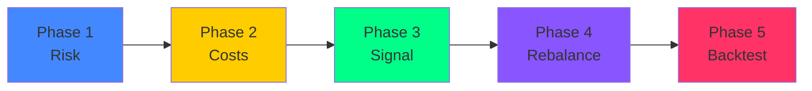

# 🔄 Crypto Funding Rate Arbitrage Engine

> Moteur d'arbitrage de taux de financement cross-exchange avec analyse statistique, backtest event-driven et exécution automatisée.

[](https://python.org)
[](https://fastapi.tiangolo.com)
[](https://nextjs.org)
[](https://redis.io)

---

## 📋 Table des matières

- [Vue d'ensemble](#-vue-densemble)
- [Architecture](#-architecture)
- [Structure du projet](#-structure-du-projet)
- [Installation](#-installation)
- [Guide d'utilisation](#-guide-dutilisation)
- [Explication des fichiers](#-explication-détaillée-des-fichiers)
- [Stratégie d'arbitrage](#-stratégie-darbitrage)
- [Configuration](#%EF%B8%8F-configuration)

---

## 🎯 Vue d'ensemble

Ce projet identifie et exploite les différences de **taux de financement (funding rates)** entre 4 exchanges de dérivés crypto :

| Exchange | Type | Funding Interval |
|----------|------|-----------------|
| **Binance** | CEX | 8h (parfois 4h) |
| **Hyperliquid** | DEX (L1) | 1h |
| **Extended** | DEX (Starknet) | 1h |
| **Paradex** | DEX (Starknet) | 1h |

### Principe de l'arbitrage

```
Position Long (Exchange A)  ←→  Position Short (Exchange B)
         ↓                              ↓
   Reçoit le funding            Paie le funding
         ↓                              ↓
         └── Net Profit = Funding reçu - Funding payé - Frais ──┘
```

Le moteur est **delta-neutre** : les mouvements de prix s'annulent, le profit vient uniquement de la différence de funding.

---

## 🏗 Architecture

```
┌─────────────────────────────────────────────────────────┐
│                    Frontend (Next.js :3000)              │
│  Dashboard │ Live Monitor │ Strategy Lab │ Bot Control   │
└────────────────────────┬────────────────────────────────┘
                         │ REST API + WebSocket
┌────────────────────────┴────────────────────────────────┐
│                   Backend (FastAPI :8000)                │
│  ┌──────────┐  ┌──────────┐  ┌──────────┐              │
│  │ Strategy │  │   Bot    │  │  Data    │              │
│  │  Engine  │  │Supervisor│  │ Service  │              │
│  └──────────┘  └──────────┘  └──────────┘              │
└────────────────────────┬────────────────────────────────┘
                         │
         ┌───────────────┼───────────────┐
         ▼               ▼               ▼
   ┌──────────┐   ┌──────────┐   ┌──────────┐
   │  Redis   │   │ Parquet  │   │ Exchange │
   │  (Live)  │   │  (Hist)  │   │   APIs   │
   └──────────┘   └──────────┘   └──────────┘
```

---

## 📁 Structure du projet

```
PPE_Engineering_Upgrade/
│
├── 📂 data_collectors/              # Collecte de données
│   ├── 📂 historical/              # Fetchers historiques (6 mois)
│   │   ├── binance_funding.py      # Funding rates Binance
│   │   ├── binance_prices.py       # OHLCV 5min Binance
│   │   ├── extended_funding.py     # Funding rates Extended
│   │   ├── extended_prices.py      # Mark prices Extended
│   │   ├── hyperliquid_funding.py  # Funding rates Hyperliquid
│   │   ├── hyperliquid_prices.py   # OHLCV 5min Hyperliquid
│   │   ├── paradex_funding.py      # Funding rates Paradex
│   │   └── paradex_prices.py       # OHLCV 5min Paradex
│   ├── 📂 live/                    # Flux temps réel → Redis
│   │   ├── binance_live.py         # WebSocket/REST Binance
│   │   ├── extended_live.py        # REST polling Extended
│   │   ├── hyperliquid_live.py     # REST polling Hyperliquid
│   │   └── paradex_live.py         # WebSocket Paradex
│   └── 📂 pipeline/
│       └── cleaner.py              # Nettoyage et alignement multi-exchange
│
├── 📂 backend/                      # Serveur FastAPI
│   ├── main.py                     # Routes API + WebSockets
│   ├── requirements.txt            # Dépendances Python
│   ├── 📂 services/
│   │   └── data_service.py         # Accès Parquet/Redis
│   ├── 📂 strategy/                # Moteur de stratégie
│   │   ├── risk_analysis.py        # Phase 1 : ADF, Cointégration
│   │   ├── cost_model.py           # Phase 2 : Frais, Slippage
│   │   ├── signal_generator.py     # Phase 3 : Z-Score
│   │   ├── rebalancer.py           # Phase 4 : Rebalancing
│   │   └── backtester.py           # Phase 5 : Backtest
│   └── 📂 bot/                     # Bot d'exécution
│       ├── executor.py             # Ordres via CCXT
│       ├── wallet_manager.py       # Transferts inter-exchanges
│       └── supervisor.py           # Boucle principale du bot
│
├── 📂 frontend/                     # Interface Next.js
│   └── 📂 src/
│       ├── 📂 app/
│       │   ├── page.tsx            # Dashboard principal
│       │   ├── layout.tsx          # Layout + sidebar
│       │   ├── 📂 live/            # Moniteur temps réel
│       │   ├── 📂 historical/      # Analyse historique
│       │   ├── 📂 strategy/        # Labo stratégie
│       │   └── 📂 bot/             # Contrôle du bot
│       ├── 📂 components/
│       │   └── Sidebar.tsx         # Navigation latérale
│       └── 📂 lib/
│           └── api.ts              # Client HTTP/WebSocket
│
├── 📂 data/                         # Données (gitignored)
│   ├── 📂 raw/                     # Parquet bruts par exchange
│   └── 📂 processed/              # Matrices alignées MASTER_*
│
├── 📂 scripts/
│   └── flush_redis.py              # Utilitaire de nettoyage Redis
│
├── .env                             # Configuration (gitignored)
├── .gitignore
└── README.md
```

---

## 🚀 Installation

### Prérequis

- **Python 3.10+**
- **Node.js 18+**
- **Redis** (en local ou Docker)

### 1. Cloner le repo

```bash
git clone https://github.com/<votre-user>/PPE_Engineering_Upgrade.git
cd PPE_Engineering_Upgrade
```

### 2. Backend Python

```bash
# Créer un environnement virtuel
python -m venv venv
source venv/bin/activate  # Linux/Mac
.\venv\Scripts\activate   # Windows

# Installer les dépendances
pip install -r backend/requirements.txt
```

### 3. Frontend Next.js

```bash
cd frontend
npm install
cd ..
```

### 4. Configuration

Copiez `.env.example` vers `.env` et remplissez vos clés API :

```bash
cp .env.example .env
```

### 5. Lancer les services

```bash
# Terminal 1 — Backend
cd backend
python -m uvicorn main:app --port 8000 --reload

# Terminal 2 — Frontend
cd frontend
npm run dev

# Terminal 3 — Redis (si Docker)
docker run -p 6379:6379 redis
```

Accédez à **http://localhost:3000** 🎉

---

## 📖 Guide d'utilisation

### Étape 1 — Collecter les données historiques

```bash
# Exécuter chaque fetcher (un par un ou en parallèle)
python data_collectors/historical/binance_funding.py
python data_collectors/historical/binance_prices.py
python data_collectors/historical/hyperliquid_funding.py
python data_collectors/historical/hyperliquid_prices.py
python data_collectors/historical/extended_funding.py
python data_collectors/historical/extended_prices.py
python data_collectors/historical/paradex_funding.py
python data_collectors/historical/paradex_prices.py
```

### Étape 2 — Nettoyer et aligner les données

```bash
python data_collectors/pipeline/cleaner.py
```

Cela génère 6 fichiers dans `data/processed/` :
- `MASTER_PRICES_5M_ALL.parquet` — Tous les prix
- `MASTER_PRICES_5M_STRICT.parquet` — Données filtrées (<20% missing)
- `MASTER_PRICES_5M_ARBITRAGE.parquet` — Tokens sur ≥2 exchanges
- Idem pour `MASTER_FUNDING_1H_*.parquet`

### Étape 3 — Lancer les flux live

```bash
python data_collectors/live/binance_live.py
python data_collectors/live/hyperliquid_live.py
python data_collectors/live/extended_live.py
python data_collectors/live/paradex_live.py
```

### Étape 4 — Utiliser l'interface web

| Page | URL | Fonctionnalité |
|------|-----|---------------|
| Dashboard | `/` | Vue d'ensemble, top opportunités |
| Live Monitor | `/live` | Matrice live temps réel |
| Historical | `/historical` | Scanner d'opportunités + qualité données |
| Strategy Lab | `/strategy` | Analyse de risque + Backtest |
| Bot Control | `/bot` | Start/Stop bot, positions, logs |

---

## 🔬 Explication détaillée des fichiers

### 📂 `data_collectors/historical/` — Collecte historique

Chaque fichier suit le même pattern :

1. **Fenêtre dynamique** : `now - 6 mois → now` (pas de dates hardcodées)
2. **Rate limiting** : Token Bucket ou Semaphore selon l'exchange
3. **Pagination** : Boucle jusqu'à épuisement des données
4. **Sauvegarde** : Parquet avec colonnes standardisées `(datetime, timestamp_ms, market, value)`

| Fichier | API | Rate Limit | Spécificité |
|---------|-----|-----------|-------------|
| `binance_funding.py` | `/fapi/v1/fundingRate` | 2400 weight/min | Pagination page par page (1000 records/page) |
| `binance_prices.py` | `/fapi/v1/klines` | 4 req/s | Chunks de 1500 bougies 5min |
| `hyperliquid_funding.py` | POST `/info` type:fundingHistory | 0.4 req/s | Token Bucket strict, API très restrictive |
| `hyperliquid_prices.py` | POST `/info` type:candleSnapshot | 0.33 req/s | Chunks de 24h obligatoires (API tronque sinon) |
| `extended_funding.py` | `/api/v1/info/{market}/funding` | 10 req/s | Concurrence via Semaphore |
| `extended_prices.py` | `/api/v1/info/candles/{market}/mark-prices` | 10 req/s | Pagination arrière (endTime → startTime) |
| `paradex_funding.py` | `/v1/funding/data` | 20 req/s | Pagination par cursor |
| `paradex_prices.py` | `/v1/markets/klines` | 20 req/s | Chunks de 200h |

---

### 📂 `data_collectors/live/` — Flux temps réel

Chaque script interroge son exchange périodiquement et publie dans Redis.

| Fichier | Méthode | Fréquence | Clé Redis |
|---------|---------|-----------|-----------|
| `binance_live.py` | REST polling | 30s | `{TOKEN}` → `{binance: rate}` |
| `hyperliquid_live.py` | REST polling | 60s | `{TOKEN}` → `{hyperliquid: rate}` |
| `extended_live.py` | REST polling | 30s | `{TOKEN}` → `{extended: rate}` |
| `paradex_live.py` | WebSocket | Temps réel | `{TOKEN}` → `{paradex: rate}` |

---

### 📂 `data_collectors/pipeline/cleaner.py` — Pipeline de nettoyage

Le cœur du traitement de données :

1. **Chargement** : Lit tous les fichiers parquet de chaque exchange
2. **Normalisation** : Unifie les noms de tokens (`BTC-USD-PERP` → `BTC`, `1000PEPE` → `PEPE`)
3. **Correction Funding** : Binance 8h → 1h (÷8), Paradex 8h → 1h (÷8)
4. **Pivot** : Crée une matrice `datetime × (token, exchange)` alignée
5. **Filtrage** : 3 niveaux de qualité (ALL / STRICT / ARBITRAGE)

---

### 📂 `backend/` — Serveur API

#### `main.py` — Point d'entrée FastAPI

- 12 routes REST + 2 WebSockets
- CORS activé pour le frontend
- Lifecycle : initialise DataService et BotSupervisor au démarrage

#### `services/data_service.py` — Couche données

- Lit les matrices Parquet avec cache en mémoire
- Connexion Redis pour les taux live
- Scan d'opportunités : calcule l'APR pour chaque paire token/exchange

#### `strategy/risk_analysis.py` — Phase 1 : Mesure du risque

Implémente les 3 tests statistiques de la stratégie :

- **ADF** (Augmented Dickey-Fuller) : Le spread est-il stationnaire (mean-reverting) ?
- **Engle-Granger** : Existe-t-il une relation de long terme stable entre les prix ?
- **Hedge Ratio β** : Combien shorter pour chaque unité longée ?

Verdict automatique : `LOW` / `MEDIUM` / `HIGH` risk.

#### `strategy/cost_model.py` — Phase 2 : Coûts réels

Modélise tous les coûts de transaction :
- Fees Maker/Taker par exchange
- Slippage linéaire
- Gas fees (Starknet pour Extended/Paradex)
- Test de profitabilité : `E[Yield] > Costs` ?

#### `strategy/signal_generator.py` — Phase 3 : Z-Score

Le signal principal de la stratégie :

```
Z_t = (spread_t - μ_rolling) / σ_rolling

- Z < -2.0  →  LONG  (funding anormalement bas, expect augmentation)
- Z > +2.0  →  SHORT (funding anormalement haut, expect baisse)
- |Z| < 0.5 →  EXIT  (retour à l'équilibre)
```

#### `strategy/rebalancer.py` — Phase 4 : Rebalancing

- **Margin Rebalancing** : Vérifie que le collatéral est suffisant
- **Delta Rebalancing** : Maintient la neutralité `Δ ≈ 0`
- Calcule les ajustements nécessaires en USD

#### `strategy/backtester.py` — Phase 5 : Backtest

Simulation heure par heure intégrant toutes les phases :

1. Vérifie les signaux Z-Score
2. Teste la profitabilité AVANT chaque entrée
3. Cumule le funding collecté
4. Calcule : Sharpe, Max DrawDown, Win Rate, Profit Factor

#### `bot/executor.py` — Exécution d'ordres

Connecteurs CCXT pour chaque exchange. Gère :
- Placement d'ordres market/limit
- Ouverture/fermeture de positions arbitrage (long + short simultanés)

#### `bot/wallet_manager.py` — Gestion des wallets

- Suivi des balances cross-exchange
- Calcul des transferts de rebalancing
- Historique des transferts

#### `bot/supervisor.py` — Superviseur principal

Boucle continue qui orchestre le tout :

| Mode | Comportement |
|------|-------------|
| `manual` | Signaux uniquement (vous exécutez) |
| `paper` | Simulation sans capital réel |
| `live` | Exécution automatique via CCXT |

---

### 📂 `frontend/` — Interface Web

#### `src/app/page.tsx` — Dashboard

- 4 KPI cards (paires actives, best APR, avg APR, status bot)
- Tableau des top opportunités live
- Auto-refresh 30s

#### `src/app/live/page.tsx` — Live Monitor

- Matrice complète des taux de funding en temps réel
- Filtres : recherche, exchanges min
- Badges Long/Short avec couleurs
- Auto-refresh 15s

#### `src/app/historical/page.tsx` — Analyse historique

- Scanner d'opportunités (classement par APR)
- Audit de qualité des données (densité, couverture)
- Sélecteur de dataset (ALL / STRICT / ARBITRAGE)

#### `src/app/strategy/page.tsx` — Strategy Lab

- Configuration paramétrique (Z-Score, lookback, seuils)
- Résultats d'analyse de risque (ADF, Cointégration, β)
- Tableau complet des trades du backtest
- 8 métriques de performance

#### `src/app/bot/page.tsx` — Bot Control

- Start/Stop avec indicateur LED pulsant
- Configuration dynamique des paires (Add/Remove)
- Vue des positions ouvertes
- Log d'activité en temps réel (terminal-style)

---

## 📊 Stratégie d'arbitrage

### Les 5 phases



| Phase | Objectif | Implémentation |
|-------|----------|---------------|
| 1 | Vérifier que le spread est mean-reverting | ADF + Engle-Granger |
| 2 | Modéliser les coûts réels | Fees + Slippage + Gas |
| 3 | Générer des signaux d'entrée/sortie | Z-Score rolling |
| 4 | Maintenir la neutralité delta | Margin + Delta checks |
| 5 | Valider la stratégie | Backtest event-driven |

---

## ⚙️ Configuration

### Fichier `.env`

```env
# Exchanges
BINANCE_API_KEY=votre_clé
BINANCE_API_SECRET=votre_secret
HYPERLIQUID_API_KEY=...
EXTENDED_API_KEY=...
PARADEX_API_KEY=...

# Stratégie
ZSCORE_ENTRY_THRESHOLD=2.0
ZSCORE_EXIT_THRESHOLD=0.5
MAX_LEVERAGE=3.0
MAX_POSITION_SIZE_USD=10000

# Bot
BOT_MODE=manual  # manual | paper | live
```

---

## 👥 Équipe

| Nom | Rôle |
|-----|------|
| Erwan Simon | Engineering & Strategy |
| Hamza Ouadoudi | Engineering & Data |

---

## ⚠️ Disclaimer

> Ce projet est destiné à des fins éducatives et de recherche. Le trading de crypto-monnaies comporte des risques significatifs. N'investissez que ce que vous pouvez vous permettre de perdre.
